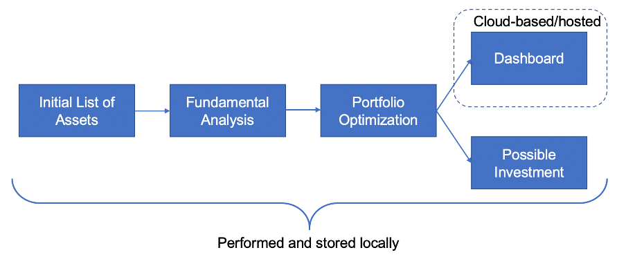
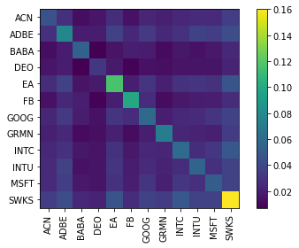
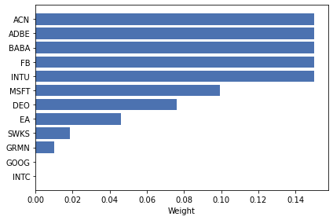
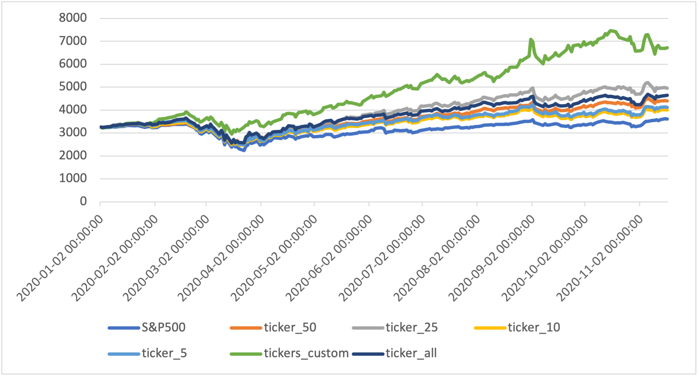
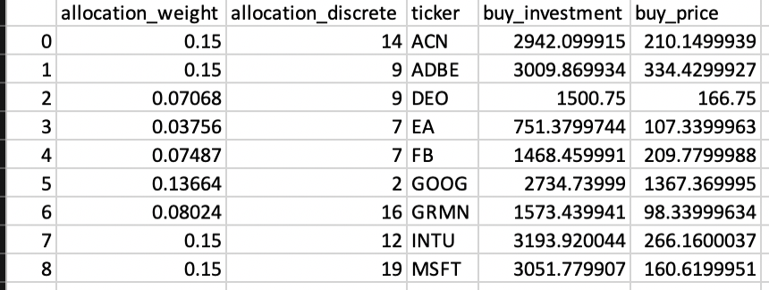
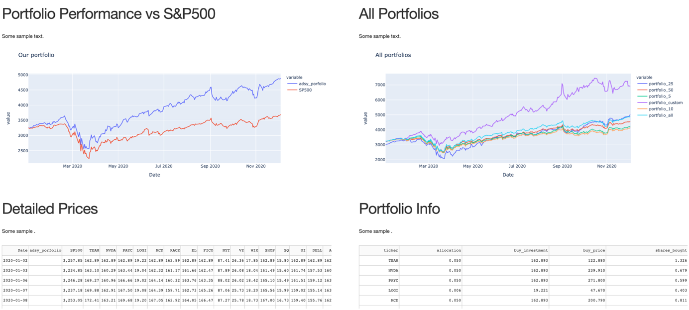

# Investment Portfolio Builder
 Repo for classic portfolio building algortihm

## Disclaimer

Not a financial advice!

This analysis was conducted just of personal interest and for personal needs. It is just a personal experience. It does not imply any advice or pretend to be truthful. The code presented here can be definitely improved in quality. The resultsts are subjective and may deviate from reality. This project covers only one small part and few possible techniques, used in stock market analysis. There are plenty more methods that can outperform the used ones. There are more many factors that could influence the stock market movement, which are not analyzed in the project. Even the successfully tested models may not yield desired results. 

However I would welcome any friendly discussions, questions, suggestions and comments. Please also be free to use this analysis in parts or in full for any purposes, yet reference would be appreciated. :) 

## Foreword

Large credit to the authors of very helpful libraries: [Fundamental Analysis](https://github.com/search?o=desc&q=fundamental+analysis&s=stars&type=Repositories) for getting company financial information and [PyPortfolioOpt](https://github.com/robertmartin8/PyPortfolioOpt), used to perform porftolio optimization techniques.

The full list of libraries used and required is stored in `requirements.txt`.

## Goal

This project’s ultimate goal is to provide thoughtful and sound quantitative analysis of possible investment portfolios. Namely, using this set of scripts it is possible to have a reasonably close look at the stock market investment opportunities. The algorithms help to narrow down large pool of possible investment targets (more than 100) using two filters: fundamental analysis and portfolio optimization:

•	Firstly, selecting the most stable and investment-suitable in the last years companies is performed, by examining their annual financial statements. Companies get rated by their financial performance, which helps to exclude potentially risky and unstable businesses. 
•	Secondly, the pre-selected companies are getting used as inputs for portfolio optimization techniques, using mean/variance analysis of the historical trading data. In this stage, only small subset of companies remains, and optimal investment is distributed across them.

Therefore, the end delivery is the potential for optimal portfolio allocation, given the large pool of companies. 

## High Level Pipeline/Architecture

The following chart represents high-level flow from the very beginning to the end:



* At first, a long list of potential companies is selected, in which it might be rational to invest based on a personal preference.
* Then their fundamentals (financials) are getting evaluated and the number of companies is cut out.
* Then porfolio optimization techniques are performed on the set of companies left, to produce several efficient portfolio options.
* The performance of portdolios are displayed on a small online dashboard, while possible investment strategies are presentend as an end result.

## Detailed Description

* Environment used: MacOS Big Sur 11.1 (Intel), Python pyenv+miniconda+3.8.5 / pyenv+3.9.0

### Step 1: Company Selection

In order to be included into the first main stage of the analysis, company (potential investment target) should meet several following criteria:
* be listed and actively traded on one of the US stock-exchanges (e.g., Nasdaq or NYSE);
* to have market capitalization of more than:
  * USD 2B for companies from Technological, Communications or Financial sector; 
  * USD 20B for companies from other sectors; 
* the financial data on the company must be available in the [FundamentalAnalysis (FA)](https://github.com/JerBouma/FundamentalAnalysis) python library of at least one last year;
* to meet arbitrary selection (i.e., companies can be excluded on a personal choice, based on location, having negative opinions, etc., e.g., many Asian companies got excluded due to having low knowledge about the market.

End list contains 140 selected companies.

### Step 2: Fundamental Analysis

#### Data Gathering

For the fundamental analysis, selected companies’ financial data is getting downloaded with FA library, which uses [Financial Modelling Prep API](https://financialmodelingprep.com/developer/docs/). Using free API pricing plan, it is possible to download financial data for each company of max latest 5 financial years. The following data is downloaded for each company and stored in the set of Excel files:
* Balance Sheet
* Income Statement
* Cash Flow
* Financial Metrics & Ratios
* Growth Ratios
* Discounted Cash Flow

API Keys are currently stored in form of a list, in the file `config.py`, excluded from this repo for security reasons (despite for being free-tier keys). The list of several keys is used, because of limit on calls in a single day.

#### Ranking the Companies

After the financial data is downloaded, every company gets evaluated on the stability and the attractiveness for the investment. From vast amount of financial data, only several metrics were identified to be important to determine, if the investment in a particular company is a solid idea. Each of them has its own arbitrary threshold value, set by expert evaluation. Those financial criteria are:

| Metric                  | Threshold Value | Threshold Source          |
|-------------------------|-----------------|---------------------------|
| EPS CAGR                | > 0.0           | Arbitrary                 |
| EPS Growth              | > 0.0           | Arbitrary                 |
| P/E Ratio               | < 15.0          | Long-term S&P 500 average |
| P/B Ratio               | < 3.0           | Arbitrary                 |
| P/S Ratio               | -               | -                         |
| PEG Ratio               | < 1.0           | Arbitrary                 |
| Dividend Payout Ratio   | > 0.0           | Arbitrary                 |
| Dividend Yield          | > 0.0           | Arbitrary                 |
| ROE                     | > 0.1           | Long-term S&P 500 average |
| ROA                     | > 0.05          | Arbitrary                 |
| Operating Income Ratio  | > 0.13          | 2019-2020 S&P 500 average |
| Operating Income Growth | > 0.09          | Arbitrary                 |
| Cash Ratio              | > 0.12          | 2019 S&P 500 average      |
| Current Ratio           | > 1.0           | Arbitrary                 |
| D/E Ratio               | < 5.0           | 2019-2020 S&P 500 average |
| Interest Coverage Ratio | > 5.0           | 2019-2020 S&P 500 average |
| Asset Turnover Ratio    | > 0.3           | 2019-2020 S&P 500 average |
| Asset Growth            | > 0.0           | Arbitrary                 |
| Free Cashflow   Growth  | > 0.0           | Arbitrary                 |

The metrics for the last two years available (disregarding which years are the last) then get evaluated (compared to):
a)	arbitrary (expert set) threshold – “hard check”;
b)	average value from all the companies within the analysis for the last year – “soft check”.

All the occurrences of a metric being “worse” than threshold, or the average value are getting logged into original Excel files with the data and counted with the following logic:

a)	each failure on the hard check (“hard failure”) counts as 1 (one);
b)	each failure on the soft check (“soft failure”) counts as 0.5;
c)	both failure types then summed up together to get the total number of failures;
d)	NB! It is enough for one year to score as fail, so that the overall metric counts as failed. Similarly, a metric failed in both years would still be counted as one fail. 

After all failures were counted, several lists are created for the companies. This lists represent % of most stable and attractive companies (with the least fail number), depending on one’s (arbitrary) opinion. The example lists created were as follows:

* **ticker_50**: portfolio where companies ranked better as median (50th percentile) were taken to the next step;
* **ticker_25**: portfolio with the companies performed better as 75% of total;
* **ticker_10**: performed better as 90%;
* **ticker_5**: top-5% companies;
* **ticker_all**: all the companies from the initial list, without taking Fundamental Analysis into consideration.

#### Custom portfolio

One additional list (portfolio) of companies was added to the above-mentioned:

* ticker_custom: a custom list of companies selected by the expert opinion, disregarding fundamental analysis. Includes following companies:

|      Ticker     |      Company                 |      Ticker     |      Company                           |      Ticker     |      Company                   |
|-----------------|------------------------------|-----------------|----------------------------------------|-----------------|--------------------------------|
|     AAPL        |     Apple Inc.               |     QCOM        |     QUALCOMM Incorporated              |     MA          |     Mastercard Incorporated    |
|     ADBE        |     Adobe Inc.               |     EA          |     Electronic Arts Inc.               |     PYPL        |     PayPal Holdings, Inc.      |
|     CRM         |     salesforce.com, inc.     |     FB          |     Facebook, Inc.                     |     V           |     Visa Inc.                  |
|     INTC        |     Intel Corporation        |     GOOG        |     Alphabet Inc.                      |     AMZN        |     Amazon.com, Inc.           |
|     MSFT        |     Microsoft Corporation    |     NFLX        |     Netflix, Inc.                      |     NIO         |     NIO Limited                |
|     NVDA        |     NVIDIA Corporation       |     TWTR        |     Twitter, Inc.                      |     TSLA        |     Tesla, Inc.                |
|     ORCL        |     Oracle Corporation       |     ZM          |     Zoom Video Communications, Inc.    |                 |                                |

Those "porfolio candidates" are saved to csv to be uzed into optimization process.

### Step 2: Portfolio Optimization

The next step of the analysis is a production of optimal portfolios, based on the lists of companies obtained in the Fundamental Analysis step.

#### Data Gathering

For each company (ticker) in a given portfolio, historical close prices (daily) are getting downloaded. There are two datasets that is required to obtain:
* “training set” with the values to be used for optimizing the portfolio;
* “test set” with the values in a timeframe after training set, that will be used for validating how well did portfolio perform.

The timeframe in this case is arbitrary constant – for the training set currently two sets of data has been used in test runs:
* from Jan 1, 2015 to Dec 31, 2019;
* from Jan 1, 2010. To Dec 31, 2019.

Test set in this case has to be after the end of the training set, so that the optimizer won’t account for it, but still in the observable timeframe to be able to evaluate the performance. Thus, current test set is:
* from Jan 1, 2020 to Dec 31, 2020.

The data for each company for each set is obtained from publicly available data from [finance.yahoo.com](https://finance.yahoo.com/), using pre-build python library pandas Datareader. In addition, values of S&P 500 index were obtained using the same method, to be used as benchmark.

For all portfolios except ticker_custom, additional filtering step is performed to exclude the companies from the analysis, that do not have enough observation values (i.e., went to IPO too recently). The minimum value that is considered enough is at least half of the interval of the training data.

#### Optimization

Portfolio optimization is performed using Efficient Frontier Optimization using [PyPortfolioOpt](https://github.com/robertmartin8/PyPortfolioOpt) library.

In short, for each asset, mean return as well as covariance matrix across all assets must be calculated. In addition, arbitrary risk-free rate should be determined and the arbitrary boundaries for minimum and maximum investment into single asset should be set. For this particular case, the following main points to be noted:

* Optimizer: Efficient Frontier Optimization
* Target: Maximum Sharpe Ratio
* Return calculation: Simple Returns
* Risk assumption: Covariance Shrinkage / Ledoit-Wolf
* Regularization (optional): L2 Regularization / gamma=1
* Risk-free Rate: 0.85% (10-year US treasury bond yield in Nov 2020)
* Bounds: Normally each stock could be dropped from portfolio by the optimizer (meaning lower bound of 0.0), except for ticker_custom portfolio, where lower bound is 0.01 (at least 1% of the capital must be invested in each stock). The maximum investment into one stock could range from 5% to 15% based on number of the companies.

For each portfolio, optimization is performed with the following outputs:

* weights for each asset in portfolio;
* expected annual return;
* annual volatility;
* Sharpe ratio;
* covariance matrix

Example output:
```
OrderedDict([('ACN', 0.15), ('ADBE', 0.15), ('BABA', 0.15), ('DEO', 0.07605), ('EA', 0.04622), ('FB', 0.15), ('GOOG', 0.0), ('GRMN', 0.01024), ('INTC', 0.0), ('INTU', 0.15), ('MSFT', 0.0991), ('SWKS', 0.01839)])

Expected annual return: 20.0%
Annual volatility: 16.5%
Sharpe Ratio: 1.09

```




#### Post-processing Weigths

After optimal weights have been generated, it is often necessary to do some post-processing before they can be used practically. In particular, you are likely using portfolio optimization techniques to generate a portfolio allocation – a list of tickers and corresponding integer quantities that you could go and purchase at a broker. This is necessary, as sometimes it is not possible to buy exact amount of stock returned by the algorithm, as most brokers are not allowing purchase of fraction of a share.

This problem is getting solved using Integer Programming from PyPortfolioOpt library. 

Sample output of weights after processing includes integer stocks to be purchased and deviations from the desired non-discrete allocations (with the total RMSE presented):

```
{'ACN': 14, 'ADBE': 9, 'BABA': 14, 'DEO': 9, 'EA': 9, 'FB': 15, 'GRMN': 2, 'INTC': 1, 'INTU': 11, 'MSFT': 13, 'SWKS': 3}
Money left: 3.2699661254882812
ACN: allocated 0.147, desired 0.150
ADBE: allocated 0.148, desired 0.150
BABA: allocated 0.148, desired 0.150
DEO: allocated 0.076, desired 0.076
EA: allocated 0.048, desired 0.046
FB: allocated 0.154, desired 0.150
GOOG: allocated 0.000, desired 0.000
GRMN: allocated 0.010, desired 0.010
INTC: allocated 0.003, desired 0.000
INTU: allocated 0.144, desired 0.150
MSFT: allocated 0.103, desired 0.099
SWKS: allocated 0.018, desired 0.018
Allocation has RMSE: 0.003
```

#### Backtesting

After portfolio has been optimized and the weights for each asset have been assigned, each portfolio gets tested on the “unseen” test data. Backtesting is a term used in modeling to refer to testing a predictive model on historical data. Backtesting is a type of retrodiction, and a special type of cross-validation applied to previous time period (Wikipedia).

Current flow implies that portfolio has been built on 31.12.2019, so starting first trading day in 2020 (02.01.2020), portfolio can go live. As mentioned before, the whole period of year 2020 is going to be used for backtesting. 

Since the data on historical close prices has been obtained and portfolio weights allocated, they are just got multiplied to get weighted price of each asset in the portfolio. Discrete values are not taken into consideration at this stage. The total size of the portfolio is assumed to be the same, as the value of S&P 500 index on the start date – in this case it is possible to see exactly, how they did both perform in a direct comparison. Using the same calculation for each portfolio, we can see a direct comparison between all of them and the S&P 500 benchmark.



That shows that all portfolios outperformed the benchmark at least by some level, with custom portfolio being on top – due to high prevalence of tech stocks that were booming in the second half of 2020.

The portfolios could be followed on a continuous basis, re-running the script that updates the data to get latest prices on the new, previously unseen days. 

#### Real Portfolio Allocation

It is possible to directly allocate the desired initial sum into portfolio and to get the real representation of how many stocks should be bought and how much would be invested in each asset. In this example, a USD 20,000 were set as the investment to the above-shown portfolio:



In practice, a second set of data is used to create real portfolios. They are created after the test indices were made, but this time no split for training and test data is done. For the real portfolio, the full timeframe is given to the optimizer to get the output. In this case, start date of the analysis remains the same (e.g., Jan 1, 2015), but end date is set as the last full trading date available. These portfolios could significantly deviate from “test” portfolios, as they incorporate a full new year of values. The output then is calculated in discrete number of stocks to buy for given investment amount. The performance metrics for each portfolio (returns, risk, Sharpe) are then getting stored in txt file.

#### Rebalancing

Another script is set to rebalance portfolio weights. It does take new date range (up to last date available) and saved weights and use them as a started weigths for the new portfolio. As a result, portfolio weights are updated and re-saved, based on recent price movements.

### Portfolio Dashboard

After portfolio has been created, the changes and the development of the portfolio can be followed within an online dashboard. It is currently accessible at http://adsy-portfolio.tk/, or in case the hosting is temporarary down, on the underlying AWS EC2 IP: http://3.140.134.86/. 

The key part at this stage is the output of the portfolio optimization, indicating the weights and total sums to be invested in each asset. Using that, the data file for the dashboard could get continuously updated with the new asset prices from finance.yahoo.com and weighted with the allocation weights defined previously. The weighted prices then get stored in a .csv file.

Using this data, it is possible to create and host a simple dashboard using pyhon library Plotly/Dash. This allows to build simple HTML web pages and populate them with text, tables or charts generated directly in python. Currently the small script:

* takes csv files as an input;
* tidies the data and creates few simple charts;
* pass it to a pre-defined HTML skeleton;
* sets the interval for of 1 day (exact 24 hours) for calling update on the data.

Currently it renders 4 elements on the page:
* a comparison of the selected portfolio (ticker_25) with S&P 500 benchmark;
* a comparison between all 6 portfolios;
* a detailed investment in each of the assets in the selected portfolio and how this price of each asset changes over time;
* an information sheet about the selected portfolio, initial investment, allocation, number of shares bought.



#### Updating Data

Another script is currently taking care of downloading the data itself. The same script from portfolio optimization is reused to get updated data for the new period from finance.yahoo.com with python pandas Datareader and store it into csv files. From there it gets to the dashboard script.

#### Hosting

The hosting is done via script put to run on AWS EC2 instance.

## Results

Using this set of scripts, it was possible to produce several optimal portfolios, based on both fundamental and portfolio optimization approaches, as well as track their performance in a form of a dashboard.

## Licensing

MIT License
Copyright (c) 2021, Artjoms Formulevics
